Maslow's Hierarchy of Needs serves as a model for assessing human behavior, offering insights into the profound shifts witnessed during the pandemic. From altered relationship dynamics to revised safety measures and changing professional priorities, our needs underwent a transformative evolution.

The pivotal consideration lies in whether the data collected during this critical period truly encapsulates our emotions and intuitions. Is it aligned with Maslow's enduring theory, a testament to its continued dominance in shaping our daily lives? This study delves into the pandemic-induced changes, exploring whether Maslow's framework remains a relevant and accurate tool for understanding these shifts.

Our research only encompasses EU countries. By examining the intricacies of the data at hand, we aim to uncover the resonance between our evolving needs and the timeless principles outlined by Maslow's Hierarchy, providing a nuanced perspective on the enduring impact of his theory.
The ultimate goal is to redefine this sacred hierarchy in order for it to resonate with the reality that was the life during the pandemic

This behavioral study bases itself on web-browsing data such as Wikipedia page views and Google trends, transportation and mobility data provided by Google and Apple, and EU-centric unemployment data.

# **Methods**
## Categorization task
While Mobility and Unemployment Data directly point us to the lower-two levels of the pyramid, Physiological Needs and Safety, exctracting data for the upper three levels is a bit more intricate: Wikipedia pages and topics are not intuitively classified into Esteem, Love and Affection and Self-Actualization, this needed to be done in order to complete the study.

## Difference in Differences

# The secrets of the Pyramid
## Physiological Needs
Our assessment of Physiological Needs drew primarily from the Global Mobility Report and Google Trends. These needs encompass essentials like food, water, and fundamental health requirements, such as medicine, supplements, or vitamins. Typically, these items are procured from grocery stores or pharmacies. Given that these establishments were considered essential businesses during the pandemic, people continued to have access to them. To gauge the shift in physiological needs during the challenging times of the pandemic, we will examine how the frequency of visits to these critical businesses changed, as indicated by mobility data. Additionally, we'll look at Google Trends data for 'Grocery Store' and 'Pharmacy' searches to corroborate or challenge our initial findings.

By comparing the percent change in visits to grocery stores and pharmacies with the average percent change across all types of locations, we can infer their relative significance during the pandemic. A positive differential implies that grocery stores and pharmacies experienced a lesser decline—or even an uptick—in visits compared to the general trend in mobility. Conversely, a negative differential indicates that these venues saw a steeper decline in visits than the average. Observing either a positive or no significant difference overall, it is reasonable to conclude that the fulfillment of physiological needs, as represented by grocery stores and pharmacies, maintained or increased their importance during the COVID-19 period.

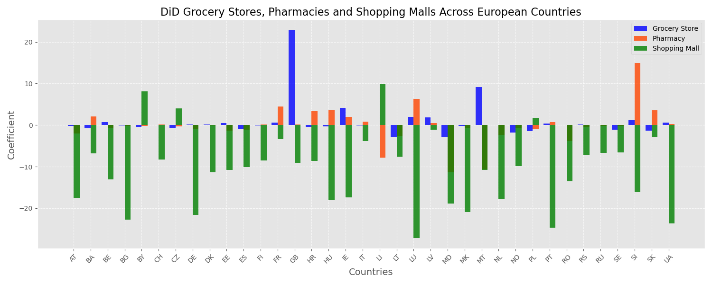
The bar chart indicates that based on Google Trends data, there was generally a smaller reduction—or in some cases, an increase—in the public's interest in grocery stores and pharmacies compared to shopping malls during the pandemic. This suggests that essential needs, such as those for food and healthcare, maintained a consistent level of importance as reflected by online search behaviors.

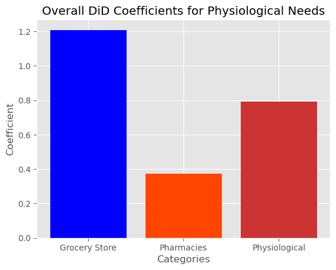
Averaging all the coefficients together, we can determine how much more dominant physiological needs were during the pandemic.The bar plot below displays the overall fluctuation in grocery shopping, pharmacy and overall physiological needs.

## Safety
EU Unemployment Data revealed a few things about how financial safety's place evolved during the pandemic. Preliminary studies on the overall number of inactive people show how the inactive European population was distributed amongst different groups: the number of inactive men  grew after the lockdown with respect to women, as did the number of unemployed 'young' people (under 25) with respect to 'older ' people (between the ages of 25 and 74). The pie charts help us visualize the results: labels Y_LT25 and Y25-74 respectively represent the younger and older population, as for the M and F labels, they represent male and female individuals. 
 
#### Distribution of Unemployed Individuals per Group
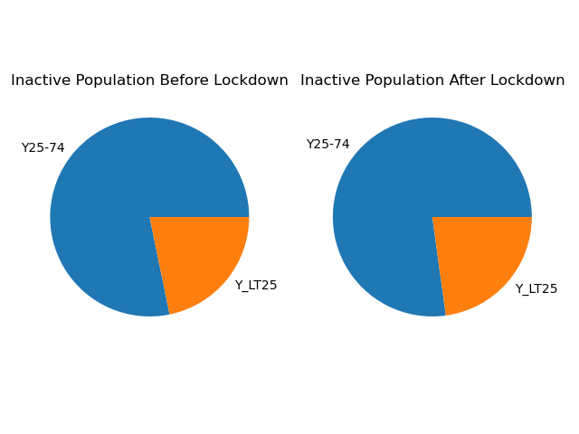
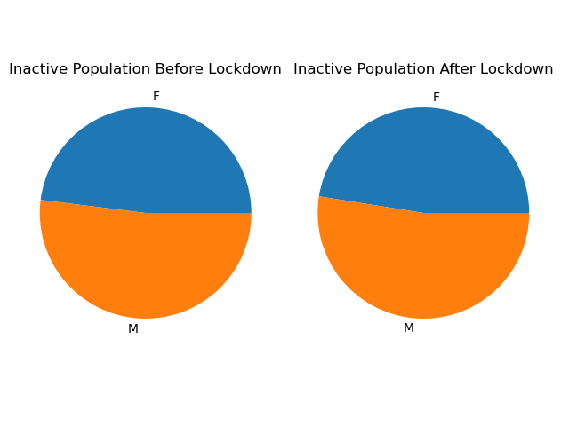

Given these results, the next natural step is to generalize to an EU-wide scale, to understand how relevant safety needs related to employment were during covid times, and the answers lie in the time-series of unemployment rates across EU countries. Naively, plotting, regressing over the data and extracting coefficients should provide the key elements to infer the evolution of safety needs.  For the remainder of this analysis, march 2020 is considered as the lockdown starting point. Identifying data as pre and post lockdown allows us to conduct the study on unemployment data.

#### Time-Series of Unemployment Rates per European Country
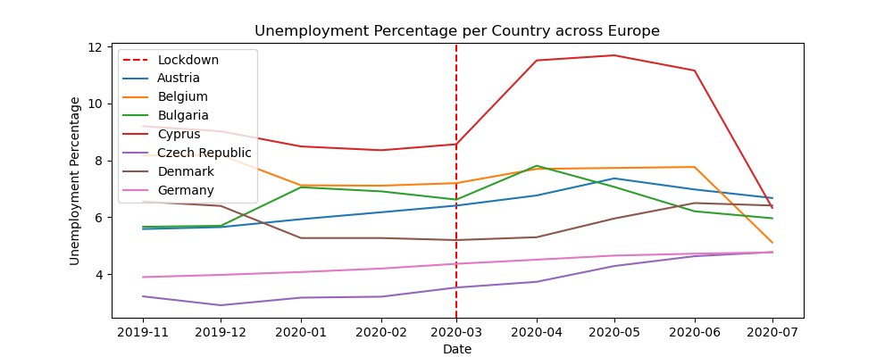
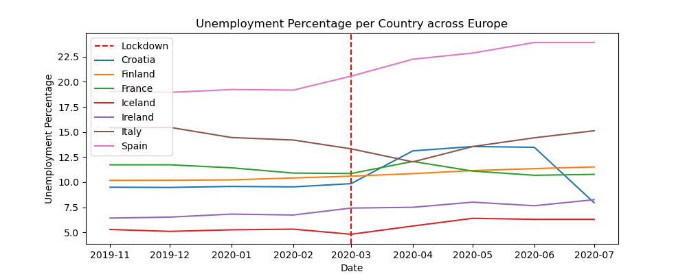
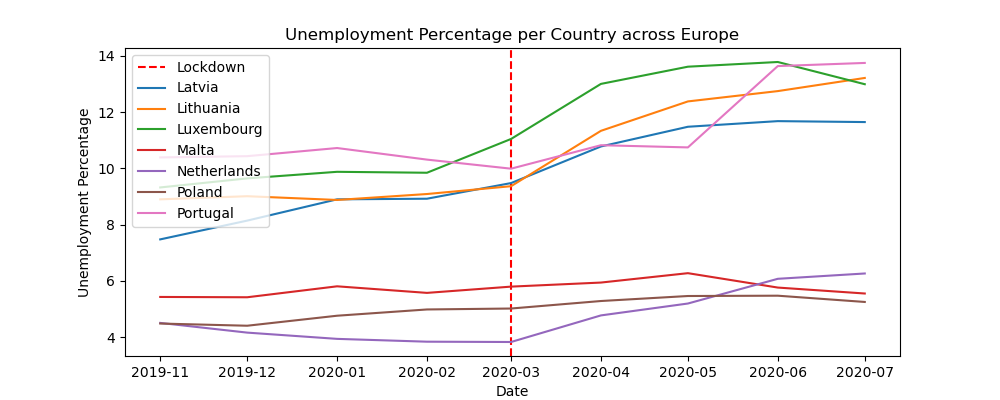
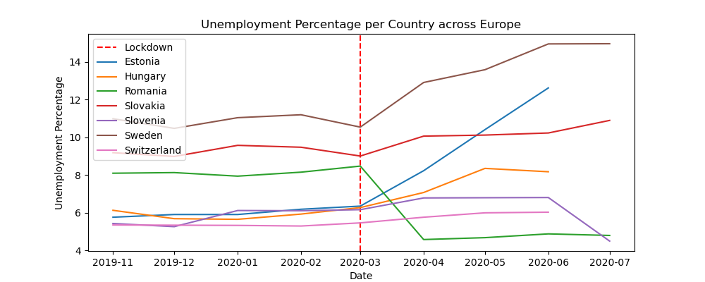
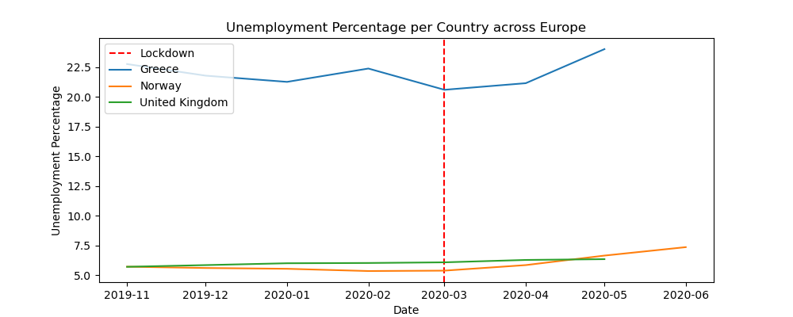

Using least squares over this data to estimate the coefficients of unemployment rate change that the lockdown-country interaction brings yield the following results:

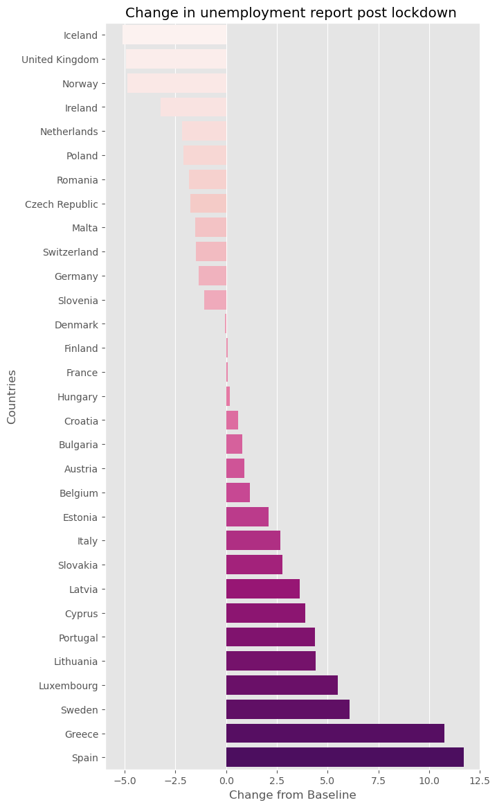

This analysis shows that some countries, like Iceland, had a thriving employment situation during lockdown whilst other countries, such as Spain, were struggling with employment levels.
However, it has one main fallacy: it does not take seasonality into account. A fallacy that **Difference in Differences** solves.

## Love and Belonging

When it comes to the top three levels of Maslow's Hierarchy, the analysis will be based on wikipedia pageviews, collected on a monthly basis between 2019-01 and 2020-08 : a period that allows us to capture the impact of different Covid-19 measures, such as lockdowns.

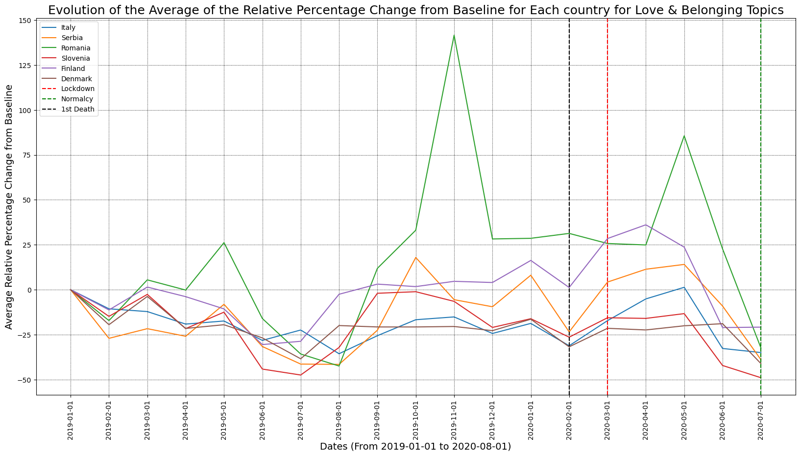

In the plot above, we see the evolution, on average, of the relative percentage change from the baseline of multiple topics related to Love & Belonging, for six different countries within europe. This allows us to evaluate how the general interest in Love & Belonging topics has evolved during this period.

We can see that they're seems to be a shift upwards in the interest of these topics straight after the first Covid-19 death and the date on which the first lockdown measures were implemented. Which would seem to suggest that the interest in Love & Belonging Topics has increased during Cocid-19 in Europe.

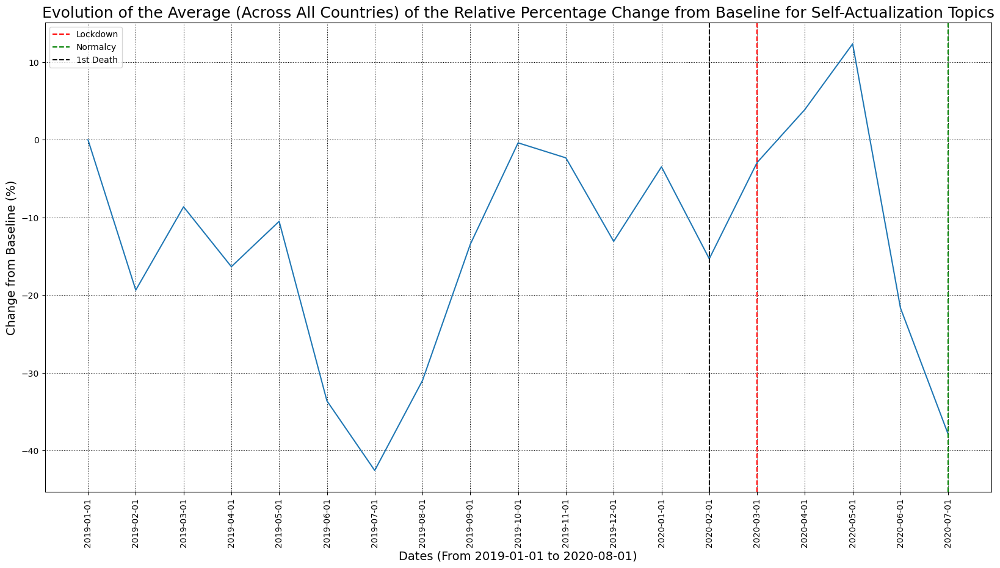

In the graph above, this shift upwards is a lot more evident. In order to have a more conclusive analysis, we will be employing a differences in differences approach.

## Esteem

The same principle is used for Esteem Topics : 

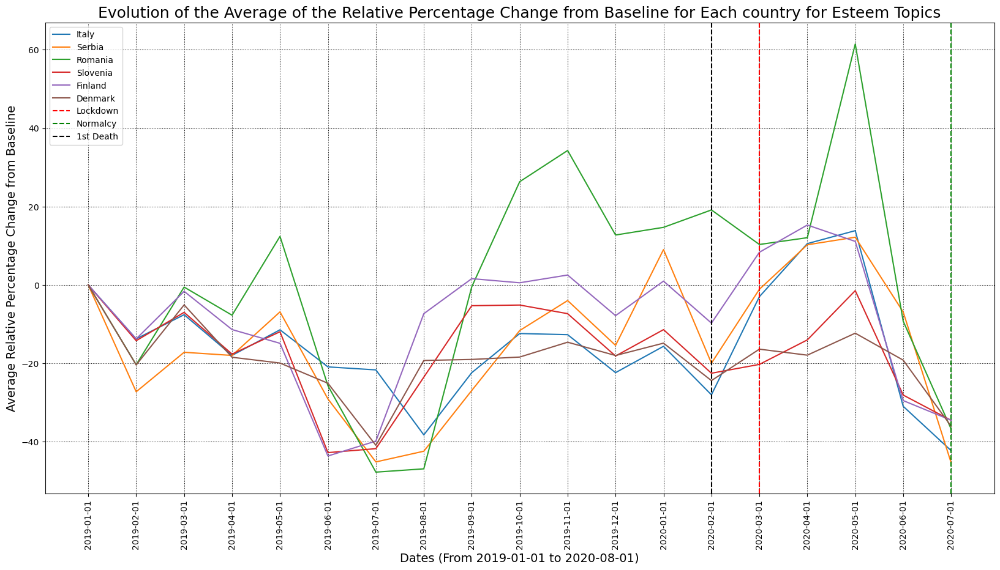
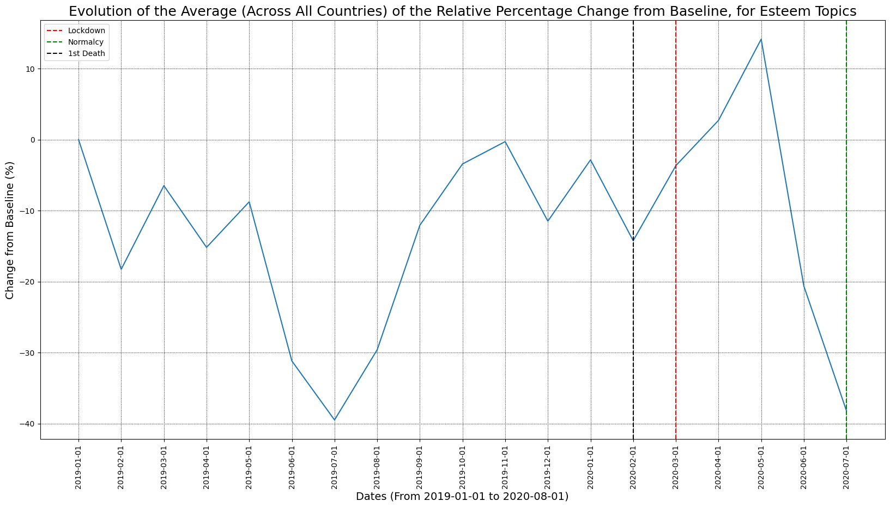

Again, looking at the above plots, we see that this trend upwards, straight after the first Covid death and the first lockdown, is very evident, especially in the second graph when we average out the data together. 

## Self-Actualization

Finally, we will look at the data representing Self-Actualization :

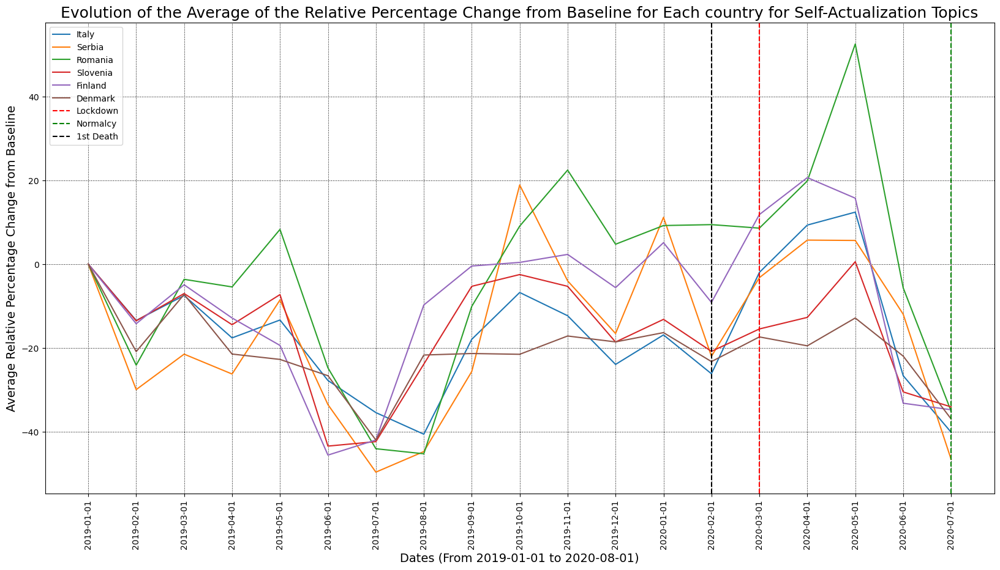

## Test Plots using plotly & Progress bars

<iframe src="eu_map.html" width="100%" height="600" style="border:none;"></iframe>

<iframe src="progress_bars.html" width="100%" height="600" style="border:none;"></iframe>>

